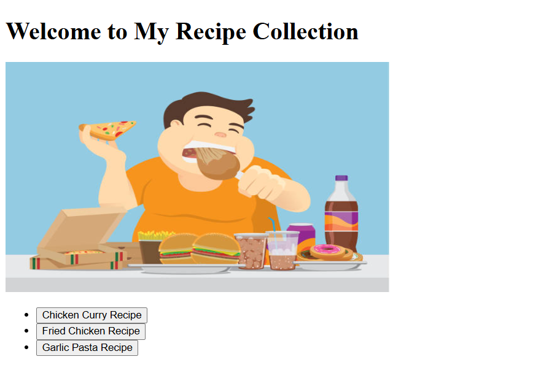

# ODIN Recipes
A website for my favorite recipes to share with others and the class

What I want on this Project : 
- a cohesive way to navigate to recipe pages 
- to look nice 
- for it to be fully functioning 
- to have all the nuts and bolts 

What I want to learn from this project 
- More comfortable with git hub in general 
- The website actually launching 
- not having to reference code all the time 

Future Improvements : 
- Making the text flow better 
- Learning how to implement a button

Here's what my website looks like

Learning Outcomes:
- Becoming more comfortable with implementing images and links 
- The order to put things in an anchor (like a button with a link not a link with a button) 
- Commenting Properly 

<a><a href="https://jay-johnson03.github.io/ODIN-Recipes/"> Live Demo</a>

